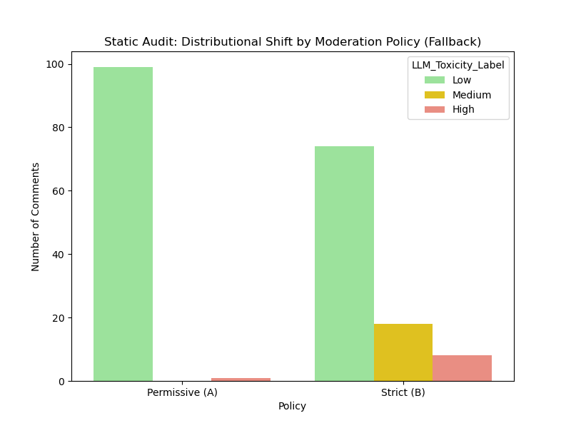
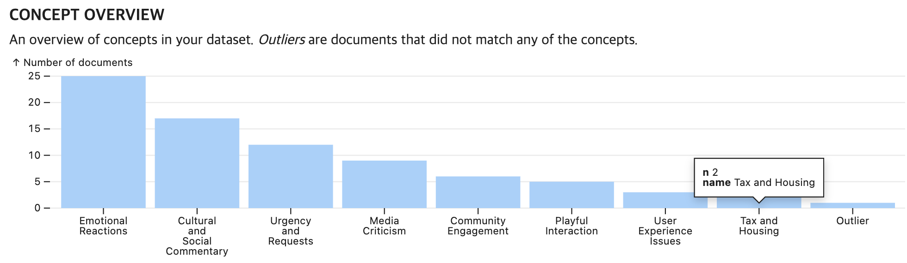
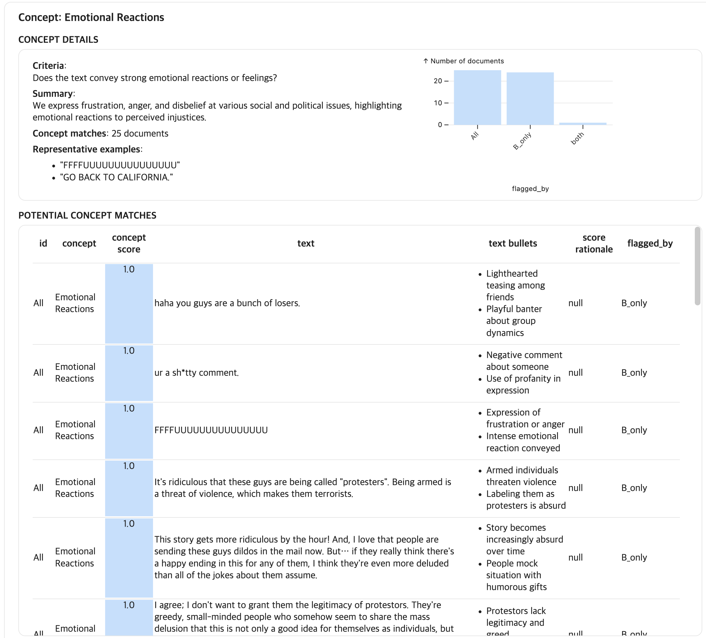

# Auditing Distributional Fairness in LLM Judgments with LLooM

This repository contains a small pilot (n=100) audit of how different moderation policies change the distribution of LLM-based toxicity judgments.  
The goal is not to improve model accuracy, but to show how policy choices redistribute what gets flagged, and to characterize the types of content uniquely flagged under a stricter policy using LLooM concept analysis.

## What this project does
1. Apply two moderation policies to the same set of text comments and assign a toxicity label (Low, Medium, High).
2. Compare label distributions between policies.
3. Create a policy-induced subset variable (flagged_by) to isolate content uniquely flagged under the stricter policy.
4. Use LLooM to induce concepts and analyze what kinds of expressions are overrepresented in the stricter-policy-only subset.

## Data
- Source dataset: Civil Comments (loaded via HuggingFace `datasets`)
- This repo does not include the original dataset files. The analysis is reproducible by running the notebook.

## Policies
- Permissive (A): High only for explicit hate speech or threats.
- Strict (B): Medium for insults, sarcasm, informal criticism; High for explicit hate speech or threats.


## Key results 
- Distribution shift:
  - Permissive (A): Low 0.99, High 0.01
  - Strict (B): Low 0.74, Medium 0.18, High 0.08
- Policy-induced subsets:
  - B_only: 25 texts flagged only under Strict (B)
  - both: 1 text flagged under both policies
- LLooM concept analysis on the flagged subset suggests that stricter moderation disproportionately flags emotionally charged and critical speech patterns rather than only explicit harm.

### Visual Evidence of Distributional Shift


### LLooM Concept Analysis (Screenshot)




## Repository contents
- `src/audit_pipeline.ipynb`: End-to-end pipeline (labeling, subset construction, LLooM analysis)
- `data/audit_results_long.csv`: Long-format labeling results
- `data/lloom_input_wide.csv`: Wide-format table with flagged_by subsets
- `data/lLoom_results.csv`: Exported LLooM results
- `figures/`: Output plots and LLooM screenshots

## Setup
1. Create and activate a virtual environment (recommended).
2. Install dependencies:
   ```bash
   pip install -r requirements.txt
